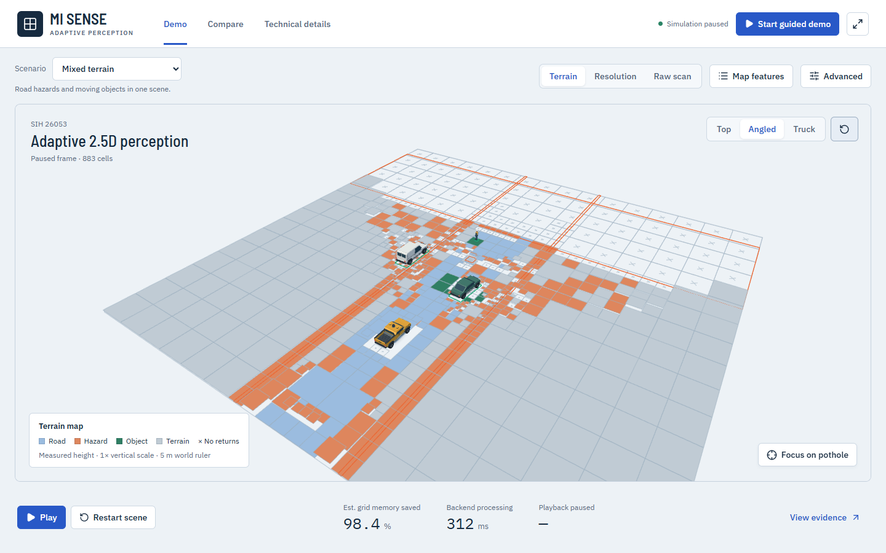
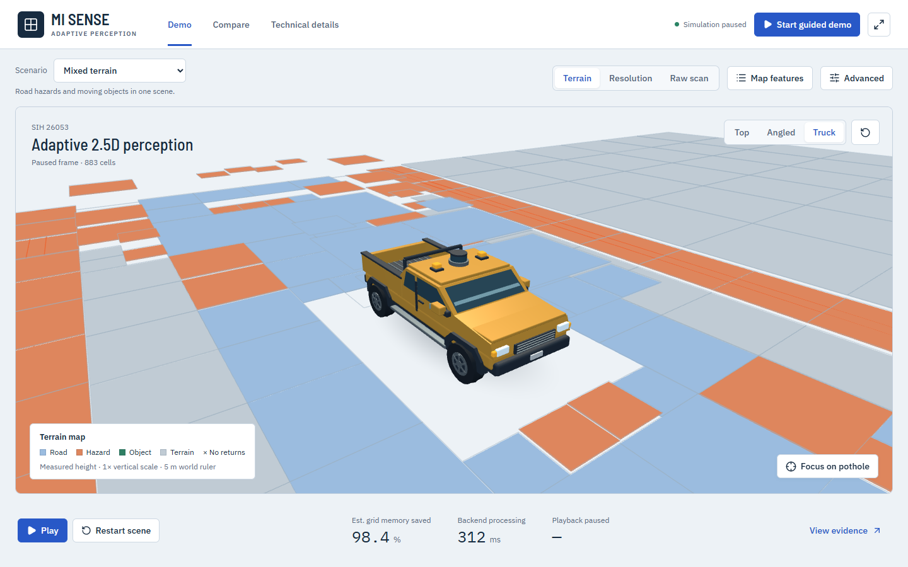
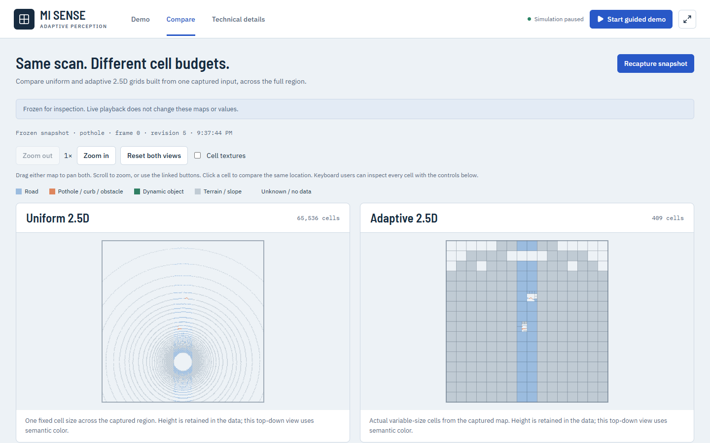

# MI Sense | Adaptive 2.5D LiDAR mapping

**SIH 26053 · Simulation prototype · About 40% of the overall project complete**

MI Sense is building an adaptive LiDAR map for dynamic environments. This repository is the completed simulation milestone: it turns simulated scans into variable-size 2.5D terrain cells, tracks moving actors, and lets you inspect the result in a browser. The 40% figure is our estimate of progress against the full project roadmap, not a count of files or lines of code.



## What you can try

- Explore six simulated scenes, including potholes, curbs, traffic, and a crossing pedestrian.
- Switch between terrain, cell-resolution, and raw-scan views. Pause, step, or restart the scene.
- Select a map cell or tracked actor to inspect its measurements.
- Compare an adaptive 2.5D map with a uniform 2.5D grid built from the **same captured scan**.
- Follow the four-step guided demo from raw returns to mapping and tracking.

| Survey vehicle view | Same-scan comparison |
| --- | --- |
|  |  |

[See the mobile view](docs/mobile-map.png) · [Read the architecture](docs/ARCHITECTURE.md)

## Project status

| Completed in this milestone | In progress for the full project |
| --- | --- |
| Simulated LiDAR scenes and interactive 3D dashboard | Connecting trained perception models to the application |
| Adaptive 2.5D elevation cells from 0.25 to 4 m | The target near-field resolution and 100 m range |
| Simulated actor detection, tracking, and static-point filtering | Accuracy-by-distance and comparable 3D memory benchmarks |
| Same-scan uniform/adaptive 2.5D comparison | Physical sensor and vehicle validation |

The detector in this repository uses **simulated actor data**. A model checkpoint trained elsewhere is not running in this application. The simulated sensor range is 50 m. Grid storage numbers in the UI are estimates for 2.5D cells, not measured process memory or a 3D voxel benchmark. The screenshots show the simulation, not a live sensor feed.

## Run locally

From the repository root on Windows, install Python and Node.js dependencies:

```powershell
python -m venv backend/venv
& ./backend/venv/Scripts/python.exe -m pip install -r backend/requirements.txt
npm --prefix frontend ci
```

Start the backend and frontend in separate terminals:

```powershell
& ./backend/venv/Scripts/python.exe -m uvicorn backend.app.main:app --host 127.0.0.1 --port 8000
```

```powershell
npm --prefix frontend run dev
```

Open <http://127.0.0.1:5173>. The frontend proxies `/api` and `/ws` to the backend. Both processes must be running for the interactive simulation.

## Check the prototype

```powershell
npm --prefix frontend run build
npm --prefix frontend run lint
npm --prefix frontend test
& ./backend/venv/Scripts/python.exe -m pytest backend/tests -q
```

The repository contains the simulation source and its tests. It does not include third-party datasets, trained weights, local caches, or experimental workspaces.
